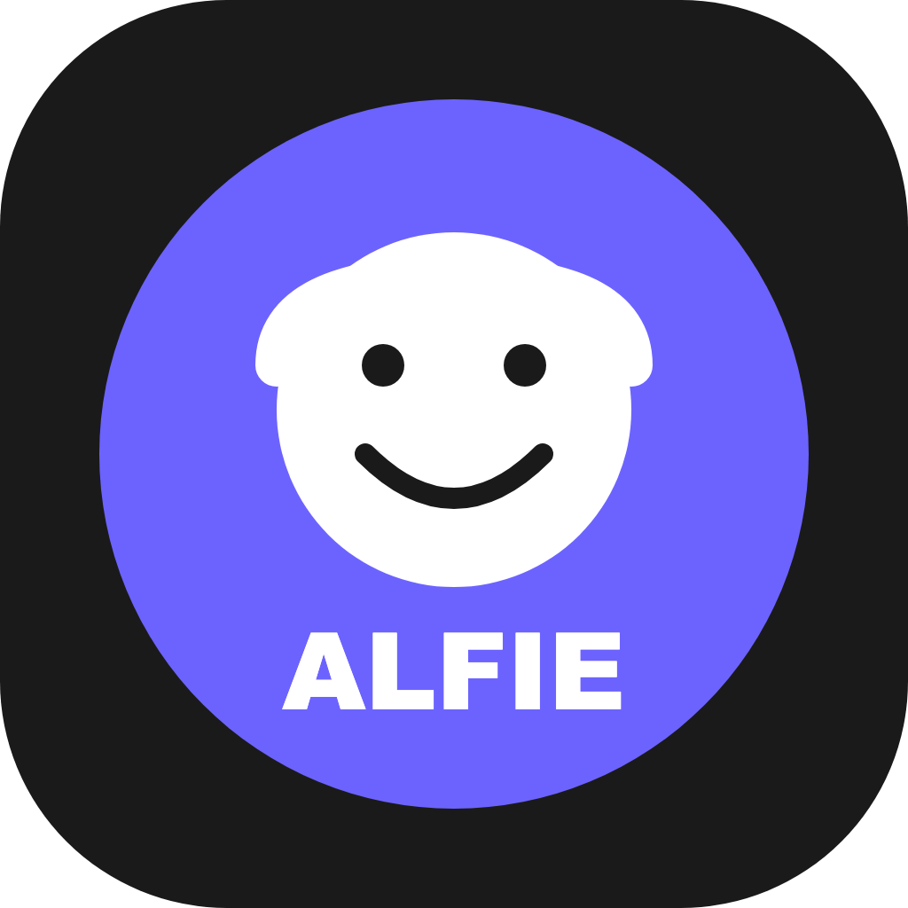
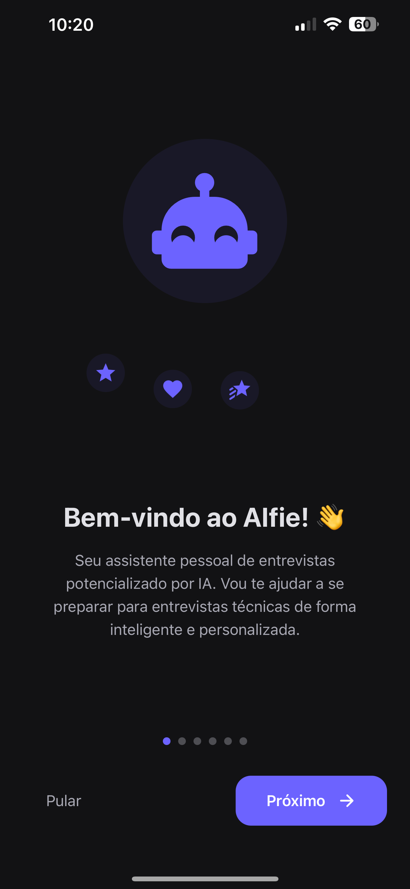
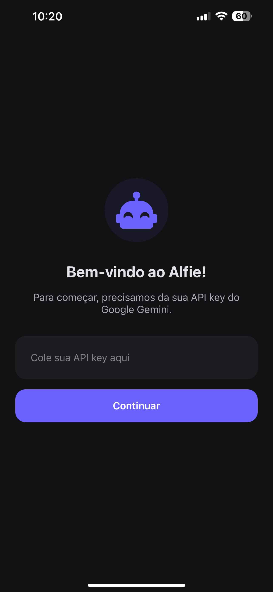
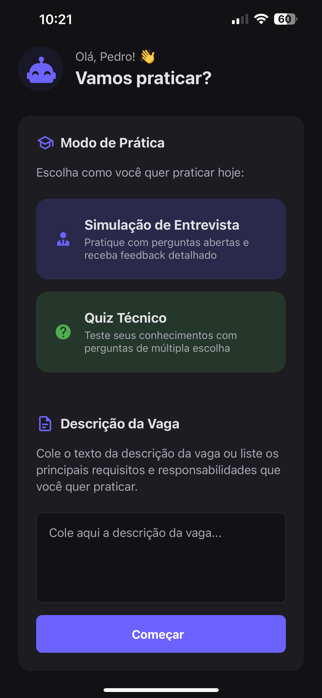
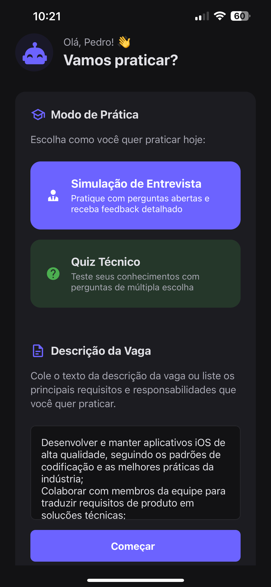
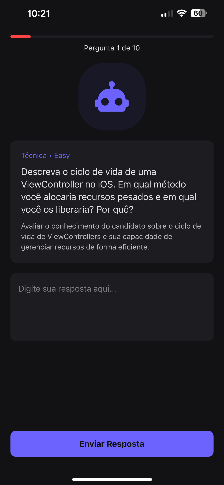
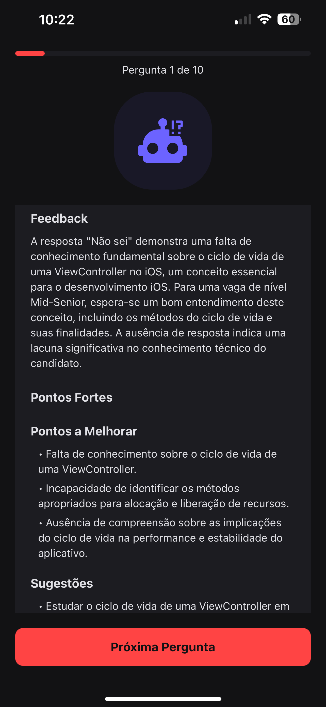
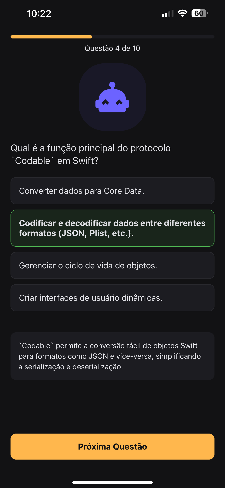
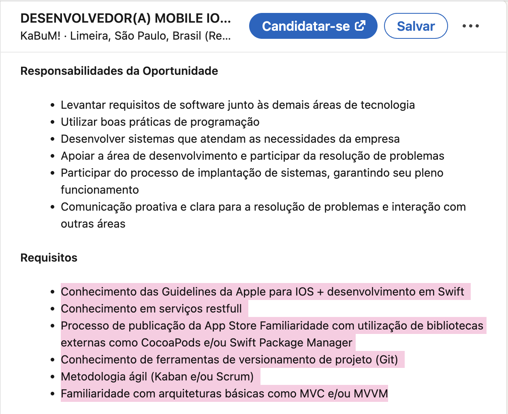

# Alfie - Seu Assistente Inteligente para Entrevistas 🚀🤖

<div align="center">



</div>

<p align="center">Prepare-se para sua próxima entrevista de tecnologia com simulações realistas e feedback alimentado por IA.</p>

<div align="center">

[](https://choosealicense.com/licenses/mit/)
[](https://reactnative.dev/)
[](https://expo.dev/)
[](https://www.typescriptlang.org/)

</div>

## ✨ Sobre o Alfie

O Alfie é o seu companheiro ideal para dominar o processo de entrevistas na área de tecnologia. Desenvolvido com **React Native** e impulsionado pela **poderosa API do Google Gemini**, ele oferece uma plataforma interativa para você praticar e aprimorar suas habilidades de entrevista, cobrindo tanto aspectos técnicos quanto comportamentais. Diga adeus à ansiedade e olá à confiança!

## 📸 Telas do Aplicativo

Veja como o Alfie se parece em ação:

|                                 Tela Inicial                                  |                                 Configuração da API Key                                 |                                         Home (Vazio)                                         |                                         Home (Preenchida)                                          |                                 Simulação de Entrevista                                 |                                 Feedback da Entrevista                                 |                                 Quiz Técnico                                 |
| :---------------------------------------------------------------------------: | :-------------------------------------------------------------------------------------: | :------------------------------------------------------------------------------------------: | :------------------------------------------------------------------------------------------------: | :-------------------------------------------------------------------------------------: | :------------------------------------------------------------------------------------: | :--------------------------------------------------------------------------: |
|  |  |  |  |  |  |  |

Para preencher a descrição da vaga basta detalhar a vaga para qual voce quer ser treinado ou simplesmente copiar os requisitos da vaga e colar no campo da Home.

<div align="center">

</div>

## 💡 Funcionalidades Principais

- 🎯 **Simulação de Entrevista Realista**: Pratique com perguntas personalizadas com base na vaga e receba feedback construtivo sobre suas respostas.
- 📝 **Quiz Técnico Interativo**: Teste e fortaleça seus conhecimentos em diversas áreas técnicas com quizzes de múltipla escolha.
- 🧠 **IA Avançada com Google Gemini**: Obtenha perguntas e feedback inteligentes e relevantes para sua preparação.
- 🌙 **Design Moderno e Intuitivo**: Uma interface limpa e agradável, otimizada para tema escuro.
- 📊 **Análise de Desempenho**: Visualize feedback detalhado após as simulações para identificar pontos fortes e áreas de melhoria.

## 🚀 Começando

Siga estes passos simples para configurar e rodar o Alfie em seu ambiente local:

### Pré-requisitos

Certifique-se de ter instalado em sua máquina:

- [Node.js](https://nodejs.org/) (versão 14 ou superior)
- [npm](https://www.npmjs.com/get-npm) ou [yarn](https://yarnpkg.com/)
- Aplicativo [Expo Go](https://expo.dev/client) instalado no seu celular (Android ou iOS)
- Uma Chave API do Google Gemini (obtenha uma em [Google AI Studio](https://aistudio.google.com/))

### Instalação e Execução

1.  **Clone o repositório e instale as dependências:**

    ```bash
    # Clone o repositório
    git clone https://github.com/seu-usuario/alfie-interview-app.git
    cd alfie-interview-app

    # Instale as dependências (usando npm)
    npm install --legacy-peer-deps

    # Ou usando yarn
    # yarn install --legacy-peer-deps
    ```

2.  **Configure sua Chave API:**

    Crie um arquivo chamado `.env` na raiz do projeto e adicione sua chave API:

    ```bash
    echo "GOOGLE_GEMINI_API_KEY=sua-chave-api-aqui" > .env
    ```

    _Substitua `sua-chave-api-aqui` pela sua chave API real._

3.  **Inicie o Aplicativo:**

    ```bash
    # Inicie o servidor de desenvolvimento Expo
    npx expo start
    ```

    Este comando iniciará o servidor e exibir\u00E1 um QR Code no terminal.

### 📱 Rodando no seu Celular

Com o servidor iniciado e o QR Code visível no terminal:

1.  Abra o aplicativo **Expo Go** no seu smartphone.
2.  Escaneie o QR Code exibido no terminal do seu computador.
3.  O Expo Go carregar\u00E1 o aplicativo Alfie diretamente no seu dispositivo para teste. Certifique-se de que seu computador e celular estejam na mesma rede Wi-Fi.

## 🎯 Como Usar

1.  Ao abrir o app pela primeira vez, insira sua **Chave API do Google Gemini** na tela solicitada (se não estiver configurada no `.env`).
2.  Na tela principal (Home), cole a **descrição da vaga** para a qual você est\u00E1 se preparando.
3.  Escolha entre **"Simula\u00E7\u00E3o de Entrevista"** ou **"Quiz Técnico"** para come\u00E7ar sua pr\u00E1tica.
4.  Siga as instru\u00E7\u00F5es na tela, responda \u00E0s perguntas e receba feedback detalhado ap\u00F3s a simula\u00E7\u00E3o ou veja seus resultados no quiz.

## 🛠️ Tecnologias Utilizadas

- [React Native](https://reactnative.dev/)
- [Expo](https://expo.dev/)
- [TypeScript](https://www.typescriptlang.org/)
- [Google Gemini API](https://ai.google.dev/)
- [React Navigation](https://reactnavigation.org/)
- [Async Storage](https://react-native-async-storage.github.io/async-storage/)
- [Styled Components](https://styled-components.com/)

## 📄 Licen\u00E7a

Este projeto est\u00E1 sob a licen\u00E7a MIT. Veja o arquivo [LICENSE.md](LICENSE.md) para mais detalhes.

## 🤝 Conecte-se Comigo

Ficarei feliz em conectar!

[](<[https://www.linkedin.com/in/pedroleda](https://www.linkedin.com/in/pedroleda)>)
[](https://github.com/pedrinholeda)

---

<div align="center">
Feito com ☕️ por Pedro Leda
</div>
